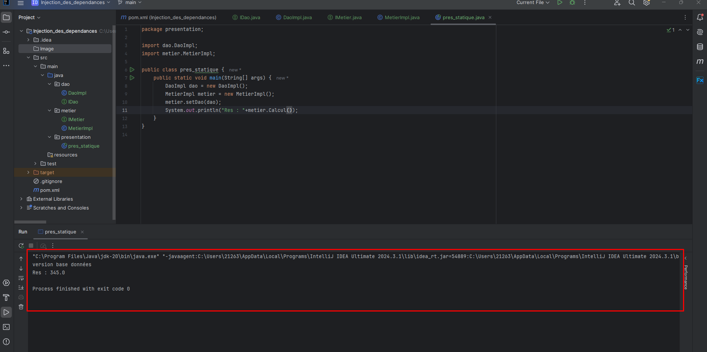

# Injection des Dépendances et Inversion de Contrôle

Ce projet illustre les concepts d'**Injection des Dépendances (DI)** et d'**Inversion de Contrôle (IoC)** à travers différentes méthodes d'implémentation : instanciation statique, dynamique et utilisation du framework **Spring**.

## 📌 Objectifs
- Comprendre l'injection des dépendances et l'inversion de contrôle.
- Implémenter une architecture à **couplage faible**.
- Expérimenter différentes méthodes d'injection de dépendances :
    - **Instanciation statique**
    - **Instanciation dynamique**
    - **Utilisation de Spring** (XML et annotations)

## 🚀 Étapes d'implémentation
### Partie 1 : Développement des interfaces et implémentations
1. **Créer l'interface `IDao`** avec une méthode `getData()`.
2. **Créer une implémentation de `IDao`** qui fournit des données simulées.
3. **Créer l'interface `IMetier`** avec une méthode `calcul()`.
4. **Créer une implémentation de `IMetier`** qui utilise `IDao` avec un couplage faible.

### Partie 2 : Injection des Dépendances
1. **Injection par instanciation statique**
    - Instancier `DaoImpl` directement dans `MetierImpl`.
2. **Injection par instanciation dynamique**
    - Charger dynamiquement l'implémentation de `IDao` via un fichier de configuration ou réflexion Java.
3. **Injection via le Framework Spring**
    - **Configuration XML**
    - **Utilisation des annotations (`@Autowired`, `@Component`, `@Service`, etc.)**
   

### Presentation Statique
1. **Version base donnée**

2. **Version web service**

